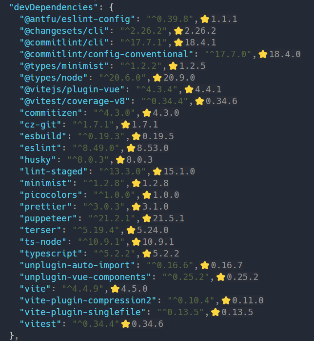
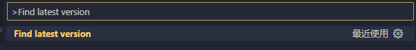

# vscode-keep-package-latest

Display the latest version of your package in package.json

# Install

serach `Package Version Updater` in vscode marketplace, or go to [vscode-marketplace-web](https://marketplace.visualstudio.com/items?itemName=plumbiu.vscode-keep-package-latest)

# Usage

`ctrl+p` in the `package.json` file, input `Find latest version` command:

# Todo

- [x] pnpm, yarn monorepo support
- [] stroage latest version
- [] fetch loading